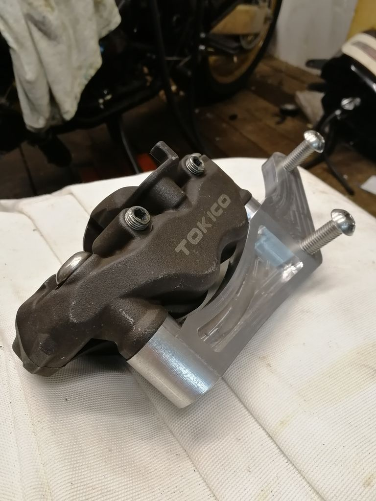
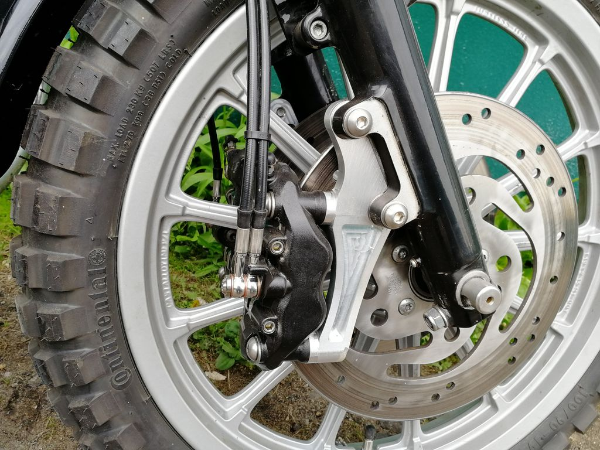
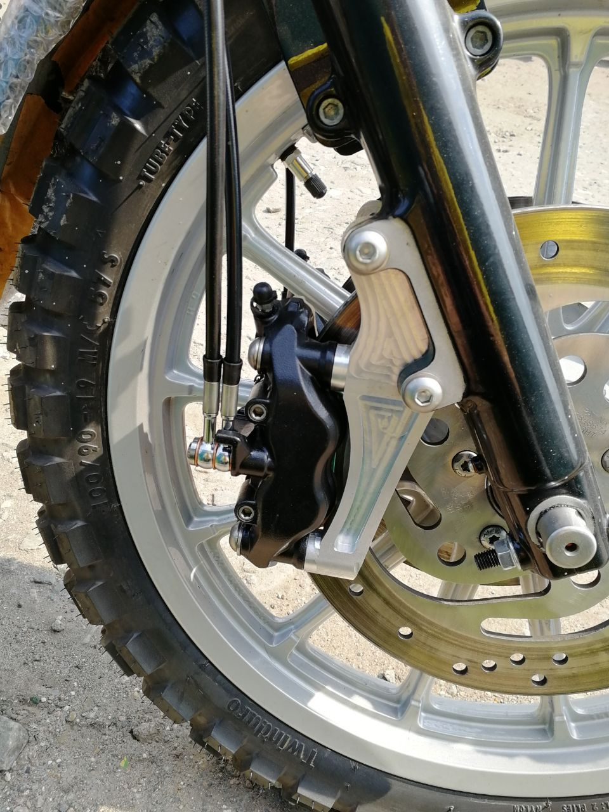
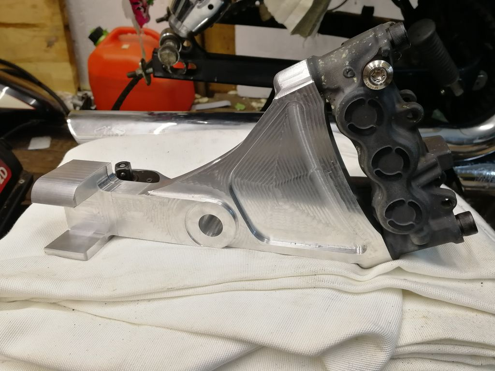
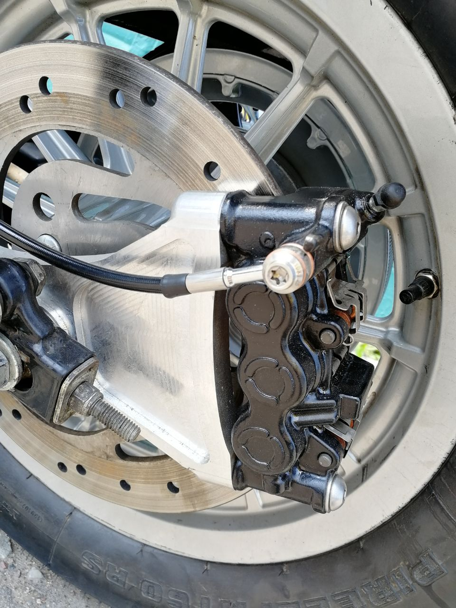

## Harley Davidson Sportster Bracket Models

* Front - 4 pot Tokico 105mm [Tested, in use]
* Front - 6 pot Advics 130mm [Never tested in practice]
* Rear - 6 pot Advics 130mm [Tested, in use]

This is a set of 3D models for machining brackets that are compatible with the Harley Davidson Sportster 2004+. 
The brackets are intended for use with stock rotors, but can also be used with enlarged rotors by adding spacers. 
It's even possible to mount a license plate on a rear rotor.

While these brackets were designed for the 2004 Sportster, they have also been tested with at least Electra of the same age.
Front Radial 105mm Calipers Ninja ZX-10R (ZX1000-E8F) 2008 - 2015

If you're using these brackets with a roadster, you'll need to mirror the model for the right side.

## Front brake Pads for 4 pot Tokico

The following front brake pads are compatible with these brackets:

    OEM Kawasaki 43082 0091
    OEM Suzuki 59100 29820
    OEM Suzuki 59100 29850
    OEM Suzuki 59100 47890
    BRAKING 898
    BREMBO 07SU27
    BRENTA 3117
    BRENTA 4117
    CL BRAKES 1133
    EBC FA379
    GALFER FD325
    GOLD FREN 213
    LUCAS/TRW MCB752
    NEWFREN FD0362
    SBS 806
    VESRAH VD-355

## Rear Mount of Front 6 Pots 130mm Calipers from:
V-Max 1700 ABS (2009 - 2015)
YZF R1 (2007 - 2014)

## Brake Pads for 6 pots Advics calipers:

    OEM Yamaha 4C8 W0045 00
    BRAKING 928
    BREMBO 07YA46
    BRENTA 4118
    CL BRAKES 1180
    EBC FA442
    GALFER FD365
    GOLD FREN 246
    LUCAS/TRW MCB795
    NEWFREN FD0407
    SBS 839
    VESRAH VD-277

Please note that this is not an exhaustive list of compatible parts, so be sure to double-check your specific motorcycle's needs before purchasing.

## License

The 3D models in this repository are licensed under the Creative Commons Attribution 4.0 International (CC BY 4.0) license. 
This means you are free to use, share, and adapt the models for any purpose, even commercially, as long as you give appropriate credit to the original creator. 
Please see the [LICENSE.md](LICENSE.md) file for the full terms of the license.